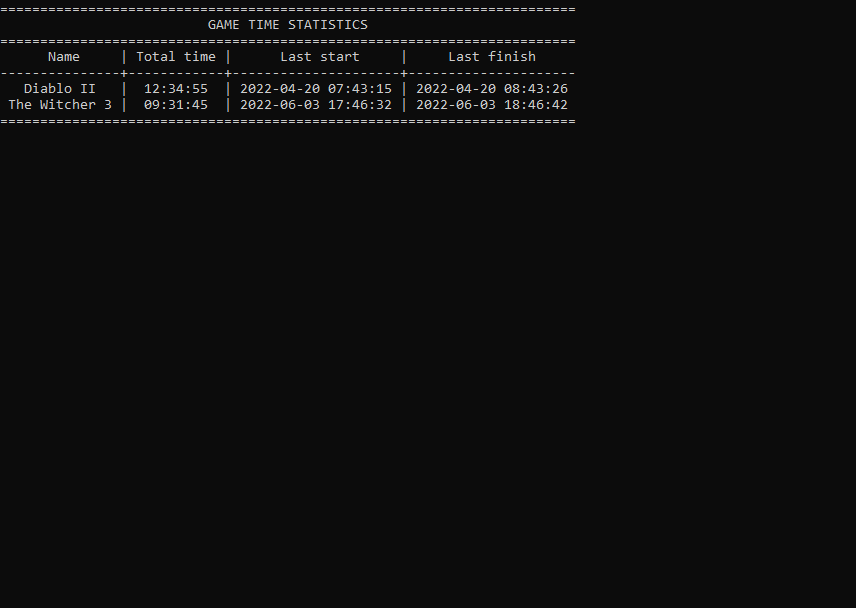
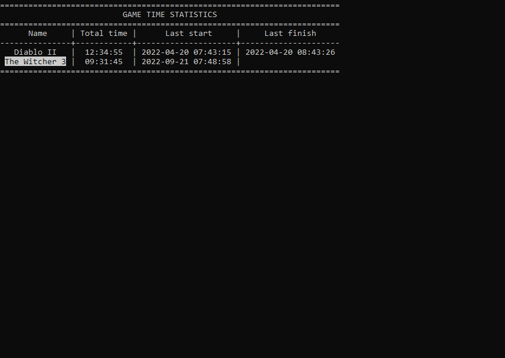
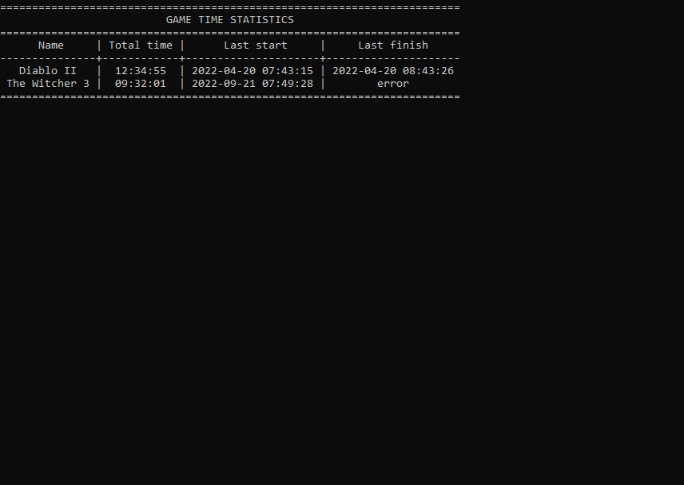
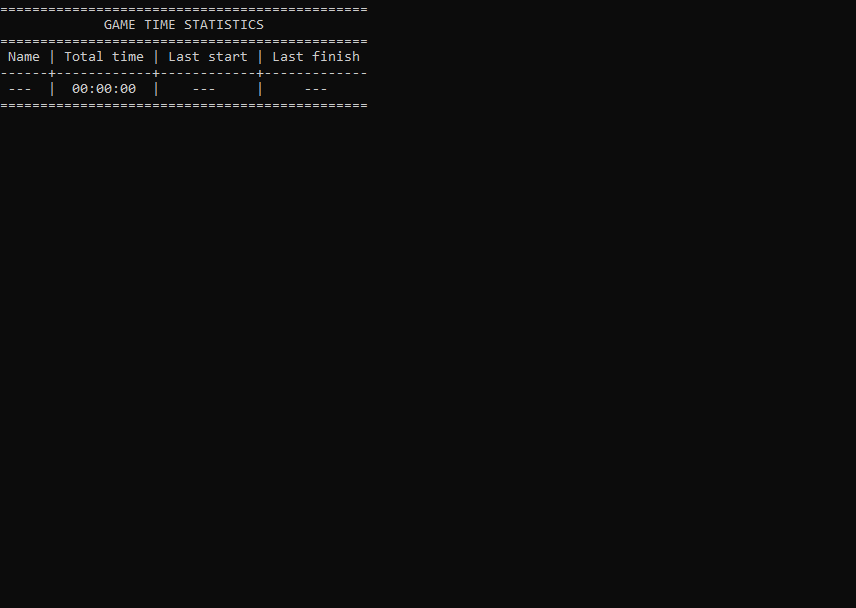

# Game Time Tracker

A CLI application to track time you've spent in a game.

## Purpose

If you play games on **_platforms that do not track time_**, 
but you really want to **_know how much time you've spent in a game_**, this is the right app for you!

## User scenario
1. Write down game `name` and it's `process` in `config.yml` as shown in the prompt in that file
2. Double click `START_ME.bat`
3. Leave the application running (minimize the window)
4. Close the application window as needed. 

_NOTE: If you close the application before the game process was terminated, the time will not be recorded!_

## Alternative use
The application may be used to track other processes as well, like messaging apps or word processors. 
Should you use it for this purpose, you might want to adjust the title of the table in `config.yml`:
change `table_title` to anything you like. You may change `title=` as well in `START_ME.bat`. 

## Limitations
This CLI **_supports Windows only_**. Sorry, Mac and Linux users. You are free to start the code from `main.py` any way you like. However, best user experience is not guaranteed in this case.

## User Interface
### Welcome screen
The welcome screen shows the current statistics for the tracked games/applications:
- name of a game/application
- total tracked time
- last start time
- last finish time

_NOTE: The table will adjust itself as you add new titles in `config.yml`_

### An application is being tracked
When an application is being tracked, it is highlighted in the table. `Last finish` time is left blank.
When you are done playing or working with an application, `Last finish` time will be recorded, the highlight will disappear.

### Error screen
If you closed Game Time Tracker before you closed the game/application and `Last finish` time hasn't been recorded, you'll get an error shown as follows. Though this time will not be added to total time, you may carry on using the tracker: the next successful game/application session will be added.

### Cold start screen
This is what you'll get when you open the application for the first time: no info about the tracked games/applications, not info in the database. Don't worry: just fill in `config.yml` as shown in the file itself and start enjoying Game Time Tracker :)
